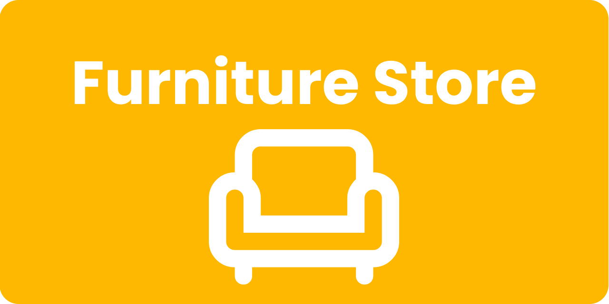
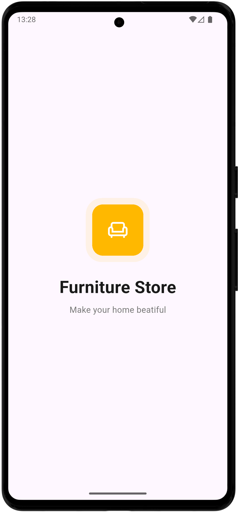
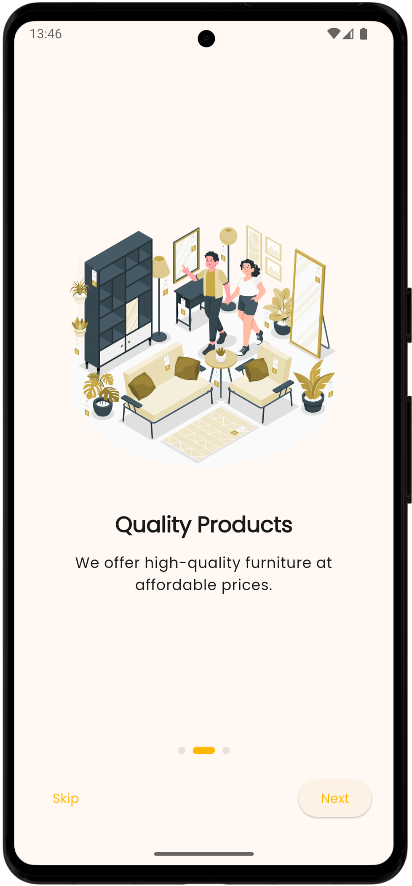

<p align="center">
  
</p>

<h1 align="center">🛋️ Furniture Store Application</h1>

<p align="center">
  A simple Furniture Store application built with Flutter. This is a personal project for learning the fundamentals of the Flutter framework.
</p>


<p align="center">
  
  
  
</p>

<h2 align="left">✨ Key Features</h2>

-   **✅ Modern & Clean UI:** A visually appealing interface with smooth animations.


<h2 align="left">📱 Screenshots & Demo </h2>


<p align="center">
 
 
</p>


<!-- <p align="center">
  <b>Animated User Flow</b><br>
  
</p> -->


<h2 align="left">🛡️ Platform Support</h2>

| Android | iOS | Web | Windows | Linux |
|:---:|:---:|:---:|:---:|:---:|
| <a href="#" title="Android is supported"></a> | <a href="#" title="iOS is unsupported"></a> | <a href="#" title="Web is unsupported"></a> | <a href="#" title="Windows is unsupported"></a> | <a href="#" title="Linux is unsupported"></a> |
| Supported | Unsupported | Unsupported | Unsupported | Unsupported |


<h2 align="left"> 📄 License </h2>

This project is licensed under the MIT License - see the [LICENSE](LICENSE) file for details.


## 🚀 Getting Started

### Prerequisites
- Flutter SDK (v3.35.0+)
- Android Studio / VS Code

### Installation
 ```sh
git clone https://github.com/dinmukhamednurkaliyev/furniture-store-application.git
```