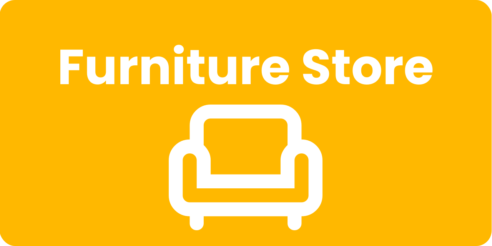

<div align="center">
  

  <h1>   About The Project </h1>

A modern **Furniture Store** application built with Flutter. This project serves as a practical learning experience for understanding the core concepts of the Flutter framework.
  
</div>

  <div align="center">
    
    
    
  </div>


<h2>  Features </h2>


<div style="display: flex; align-items: flex-start; margin-bottom: 10px;">
  
    <strong>Modern & Clean UI</strong>: A visually appealing and intuitive interface designed to provide a seamless user experience.
</div>

<div style="display: flex; align-items: flex-start; margin-bottom: 10px;">
  
    <strong>Smooth Animations</strong>: Engaging animations and transitions that enhance the overall look and feel of the application.
</div>

<div style="display: flex; align-items: flex-start;">
  
    <strong>Onboarding Experience</strong>: A clear and concise onboarding flow to introduce new users to the app's features.
</div>

<div style="display: flex; align-items: flex-start;">
  
    <strong>Responsive Design</strong>: The layout adapts seamlessly to various screen sizes, ensuring an optimal viewing experience on desktops, tablets, and mobile devices.
</div>


##   Preview

<p align="center">
   
  
</p>


<!-- <div align="center">
  <b>Animated User Flow</b><br>
  
</div> -->


<h2>   Platform Support </h2>

<div style="display: flex; align-items: center;">
     
    <strong>Android</strong>
      
</div>
<div style="display: flex; align-items: center;">
     
    <strong>iOS</strong>
      
</div>
<div style="display: flex; align-items: center;">
     
    <strong>Web</strong>
     
</div>
<div style="display: flex; align-items: center;">
     
    <strong>Windows</strong>
     
</div>
<div style="display: flex; align-items: center;">
     
    <strong>Linux</strong>
     
</div>

<h2>  Built With </h2>
<div style="display: flex; align-items: center;">
  
  <strong>Dart</strong>
</div>
<div style="display: flex; align-items: center;">
  
  <strong>Flutter</strong>
</div>
<div style="display: flex; align-items: center;">
  
  <strong>Figma</strong>
</div>
<div style="display: flex; align-items: center;">
  
  <strong>VS Code</strong>
</div>


<h2>  Getting Started </h2>

To get a local copy up and running, follow these simple steps.

**Prerequisites:**
* Make sure you have Flutter installed. [Installation Guide](https://docs.flutter.dev/get-started/install)

**Installation:**
1. Clone the repo
   ```sh
   git clone https://github.com/dinmukhamednurkaliyev/furniture-store-application.git
   ```

2. Navigate to the project directory:
    ```sh
    cd furniture-store-application
    ```

3. Install dependencies:
    ```sh
    flutter pub get
    ```

4. Run the application::
    ```sh
    flutter run
    ```

<h2>   License </h2>

This project is licensed under the MIT License - see the [LICENSE](LICENSE) file for details.


<h2>   Contributing </h2>

<h2>   Contact </h2>

<div style="display: flex; align-items: center; margin-bottom: 8px;">
    <a href="https://www.linkedin.com/in/dinmukhamed-nurkaliyev-80b5a1326/" target="_blank"></a>
    <strong>LinkedIn</strong>:&#160;<a href="https://www.linkedin.com/in/dinmukhamed-nurkaliyev-80b5a1326/">dinmukhamed-nurkaliyev</a>
</div>
<div style="display: flex; align-items: center; margin-bottom: 8px;">
    <a href="https://www.instagram.com/dinmukhamed.nurkaliyev/" target="_blank"></a>
    <strong>Instagram</strong>:&#160;<a href="https://www.instagram.com/dinmukhamed.nurkaliyev/">dinmukhamed.nurkaliyev</a>
</div>
<div style="display: flex; align-items: center; margin-bottom: 8px;">
    <a href="https://x.com/DNurkaliyev" target="_blank"></a>
    <strong>X (Twitter)</strong>:&#160;<a href="https://x.com/DNurkaliyev">DNurkaliyev</a>
</div>
<div style="display: flex; align-items: center; margin-bottom: 8px;">
    <a href="https://medium.com/@dinmukhamed.nurkaliyev" target="_blank"></a>
    <strong>Medium</strong>:&#160;<a href="https://medium.com/@dinmukhamed.nurkaliyev">@dinmukhamed.nurkaliyev</a>
</div>
<div style="display: flex; align-items: center; margin-bottom: 8px;">
    <a href="https://www.tiktok.com/@dinmukhamed.nurkaliyev" target="_blank"></a>
    <strong>TikTok</strong>:&#160;<a href="https://www.tiktok.com/@dinmukhamed.nurkaliyev">@dinmukhamed.nurkaliyev</a>
</div>
<div style="display: flex; align-items: center; margin-bottom: 8px;">
    <a href="https://t.me/dinmukhamed_nurkaliyev" target="_blank"></a>
    <strong>Telegram</strong>:&#160;<a href="https://t.me/dinmukhamed_nurkaliyev">dinmukhamed_nurkaliyev</a>
</div>
<div style="display: flex; align-items: center;">
    <a href="https://discord.com/users/1300002143377428531" target="_blank"></a>
    <strong>Discord</strong>:&#160;<a href="https://discord.com/users/1300002143377428531">dinmukhamed.nurkaliyev</a>
</div>
<div style="display: flex; align-items: center;">
    <a href="https://discord.com/users/1300002143377428531" target="_blank"></a>
    <strong>Discord</strong>:&#160;<a href="https://discord.com/users/1300002143377428531">dinmukhamed.nurkaliyev</a>
</div>

