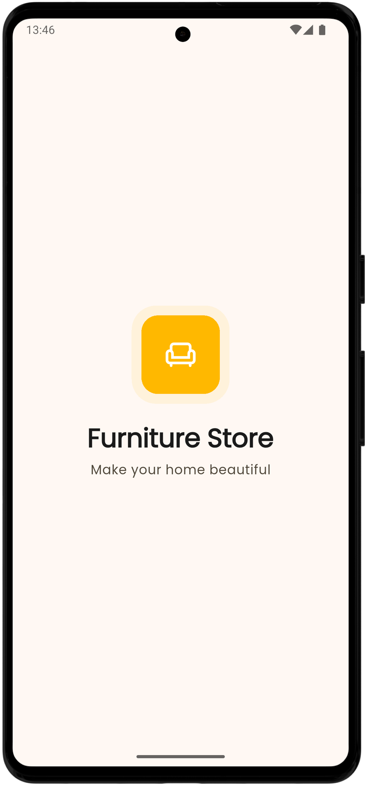

<div align="center">
  

  #   About The Project
A modern **Furniture Store** application built with Flutter. This project serves as a practical learning experience for understanding the core concepts of the Flutter framework.
  
</div>

  <div align="center">
    
    
    
    
  </div>


##  Features

-[x] **Modern & Clean UI**: A visually appealing and intuitive interface designed to provide a seamless user experience.
-[x] **Smooth Animations**: Engaging animations and transitions that enhance the overall look and feel of the application.
-[x] **Onboarding Experience**: A clear and concise onboarding flow to introduce new users to the app's features.

##   Preview

<p align="center">
   
  
</p>


<!-- <div align="center">
  <b>Animated User Flow</b><br>
  
</div> -->


##   Platform Support

-  **Android**: <span>Supported</span>
-  **iOS**: <span>Unsupported</span>
-  **Web**: <span>Unsupported</span>
-  **Windows**: <span>Unsupported</span>
-  **Linux**: <span>Unsupported</span>

##  Built With
- <a href="https://dart.dev/" target="_blank"></a> **Dart** 
- <a href="https://flutter.dev/" target="_blank"></a> **Flutter** 
- <a href="https://www.figma.com/" target="_blank"></a> **Figma**
- <a href="https://code.visualstudio.com/" target="_blank"></a> **VS Code**


##  Getting Started

To get a local copy up and running, follow these simple steps.

**Prerequisites:**
* Make sure you have Flutter installed. [Installation Guide](https://docs.flutter.dev/get-started/install)

**Installation:**
1. Clone the repo
   ```sh
   git clone https://github.com/dinmukhamednurkaliyev/furniture-store-application.git
   ```

2. Navigate to the project directory:
    ```sh
    cd furniture-store-application
    ```

3. Install dependencies:
    ```sh
    flutter pub get
    ```

4. Run the application::
    ```sh
    flutter run
    ```

##   License 

This project is licensed under the MIT License - see the [LICENSE](LICENSE) file for details.


##   Contributing

##   Contact 

<div align="center">

</div>